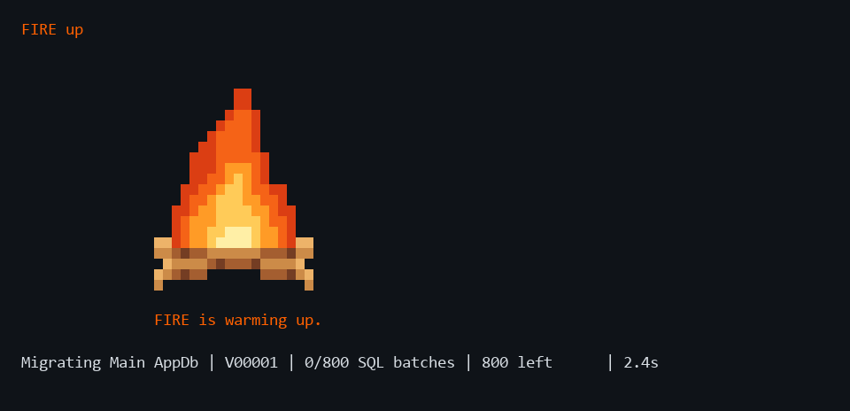

<h1 align="center">FIRE CLI</h1>

<p align="center">
  <strong>Local databases. Repeatable migrations. Clear progress.</strong>
</p>

<p align="center">
  <a href="#setup">Setup</a> ·
  <a href="#features">Features</a> ·
  <a href="#compatibility">Compatibility</a> ·
  <a href="#cli-commands">CLI Commands</a>
</p>

FIRE manages your local SQL Server or PostgreSQL databases for your project. Create or migrate databases, capture local changes as migrations, and reuse saved backups to rebuild faster.



<p align="center"><sub>Illustrative preview with example database names, SQL counts, and timings.</sub></p>

## Setup

On Windows, before running FIRE for the first time, install the [certificates.](#certificates)

From the FIRE Repository run the install comand:
```
pwsh -NoProfile -File ./fire.ps1 install
```

The installer adds `fire` to PATH and fetches tools. Run it again to update tools in the future. Keep the FIRE folder after installation.

**Main** is the database you work in.
**Shadow** is a clean copy built from your migrations.
FIRE compares them to capture your changes.

```
fire init
```
Set up new a new project with FIRE. Choose your engine and database names. Add your schema to the initial migration or start with an empty database.

```
fire up
```
FIRE creates missing databases, applies pending migrations, and prepares their Shadows.

```
fire generate
```
Change Main's schema or rows in your database editor. FIRE generates and verifies a migration.

After pulling new migrations, run `fire up` to apply the new migrations to your database.

## Features

- **Multiple databases** — Manage one or several databases in the same project.
- **Fast recreation** — Reuse clean cache backups for Main and Shadow. Existing Main databases are migrated in place.
- **Backup and restore** — Save SQL Server backups with `fire backup` & `fire restore`.
- **Preferences** — Use `fire settings` to toggle animations and success/failure sounds. Both are on by default.
- **Status and connections** — Check your databases with `fire status`. get connection details with `fire connection`.
- **Cleanup** — Choose Docker containers to remove with `fire remove`, including their FIRE database data. Recreate databases with `fire up`.

## Compatibility

### Platforms

| Platform                         | Shells                      |
| -------------------------------- | --------------------------- |
| Windows 10/11 x64                | PowerShell, CMD, Git Bash   |
| Linux x64 or ARM64               | Bash, zsh, fish, PowerShell |
| WSL2 x64 or ARM64                | Bash, zsh, fish, PowerShell |
| macOS 14+ Intel or Apple Silicon | zsh, Bash, fish, PowerShell |

Set `NO_COLOR=1` or `TERM=dumb` for numbered prompts and plain progress. Redirected output is also plain.

Windows workflows are tested. Native Linux/macOS and ARM testing is pending.

### Requirements

| Requirement      | Details                      |
| ---------------- | ---------------------------- |
| PowerShell 7.4+  | Runs FIRE internally         |
| Git              | Must be installed            |
| Docker           | Must be running              |
| .NET SDK         | Needed to install SqlPackage |

FIRE installs SqlPackage and fetches SQL Server, PostgreSQL, Flyway, and pg-schema-diff. SQL Server uses x64 images. PostgreSQL supports x64 and ARM64.

### Certificates

FIRE uses a self-signed certificate. Set it up once for your Windows account before running FIRE. Linux and macOS users can go skip this section

1. In the FIRE folder, double-click [certificates/FIRE-CLI.cer](certificates/FIRE-CLI.cer).
2. Click **Install Certificate**, choose **Current User**, then **Place all certificates in the following store**.
3. Select **Trusted Root Certification Authorities**, finish the wizard, and accept the Windows confirmation if you trust the publisher.
4. Continue with [FIRE installation](#setup). If PowerShell asks whether to trust this publisher, choose **Always run** to remember your choice.

 Certificate details:
- Publisher: `CN=Akarshan Gnaneswaran, O=FIRE CLI`
- Thumbprint: `950983C2253A8E757B52206AC5BD0D3535D55D01`

[Microsoft's explanation of script signing](https://learn.microsoft.com/en-us/powershell/module/microsoft.powershell.core/about/about_signing).

## CLI Commands

```text
FIRE help

Project
  fire init                            Set up project databases
  fire up                              Create/migrate/start databases
  fire generate                        Generate a migration
  fire status                          Show database status
  fire connection                      Show connection details

Backups
  fire backup                          Create SQL Server backups
  fire restore                         Restore database backups

Administration
  fire install                         Install FIRE and pull latest tools
  fire uninstall                       Remove FIRE launcher
  fire settings                        Change preferences
  fire remove                          Remove selected containers and images
  fire help                            Show help
```

## Tools

<p align="center">
  <a href="https://learn.microsoft.com/powershell/"></a>
  &nbsp;
  <a href="https://git-scm.com/"></a>
  &nbsp;
  <a href="https://www.docker.com/"></a>
  &nbsp;
  <a href="https://www.microsoft.com/sql-server"></a>
  &nbsp;
  <a href="https://www.postgresql.org/"></a>
  &nbsp;
  <a href="https://dotnet.microsoft.com/"></a>
  &nbsp;
  <a href="https://www.red-gate.com/products/flyway/"></a>
</p>

<p align="center">
  Schema comparison: <a href="https://learn.microsoft.com/sql/tools/sqlpackage/">SqlPackage</a> · <a href="https://github.com/stripe/pg-schema-diff">pg-schema-diff</a>
</p>
